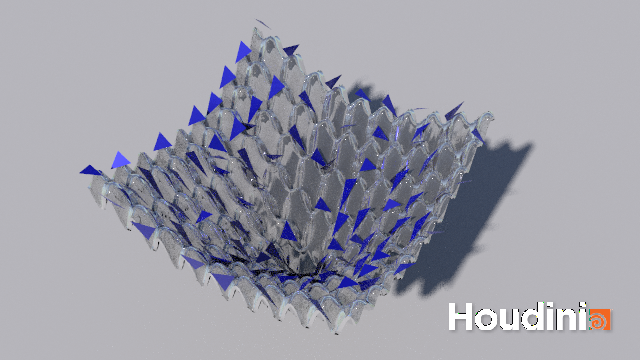

# nelder-mead-ackley
A Houdini visualization of Nelder-Mead optimization running on the Ackley function (created for CSE 274 Winter 2022).

This visualization shows the Ackley function (a nonconvex function commonly used to test optimization functions) as well as several instances of Nelder-Mead optimization running in parallel.  Nelder-Mead, a heuristic method for nonlinear derivative-free optimization, uses evaluations of the objective function on the vertices of a simplex (here, a triangle) to determine the next positions for the vertices of the simplex.

<video controls autoplay look>
  <source src="halfres_sl_gamcor45_web.mp4" type="video/mp4">
</video>
